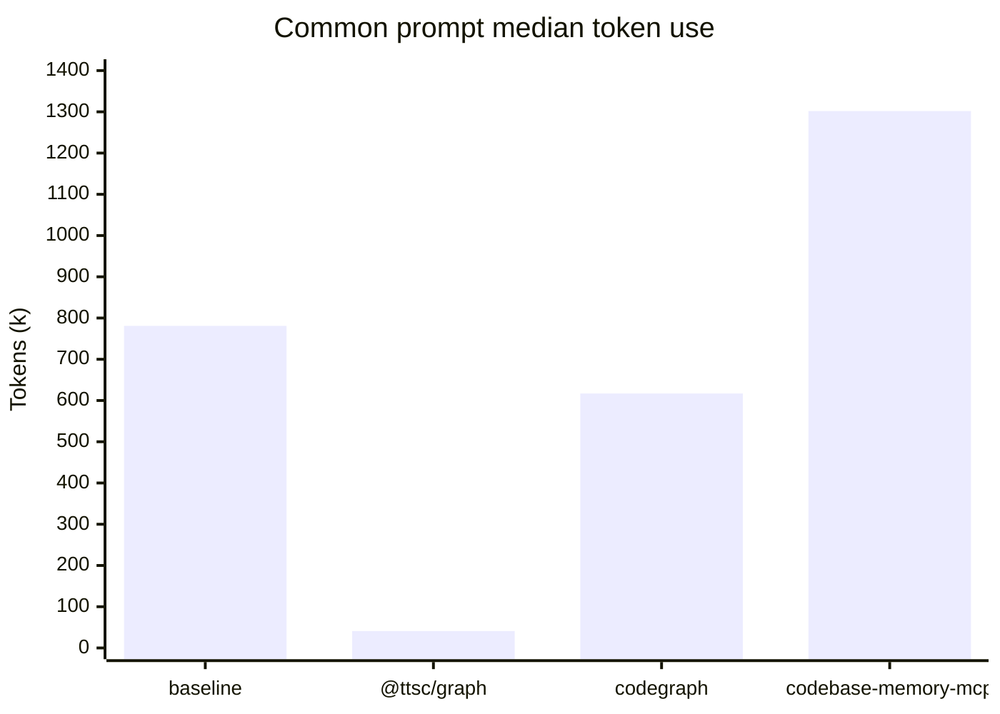
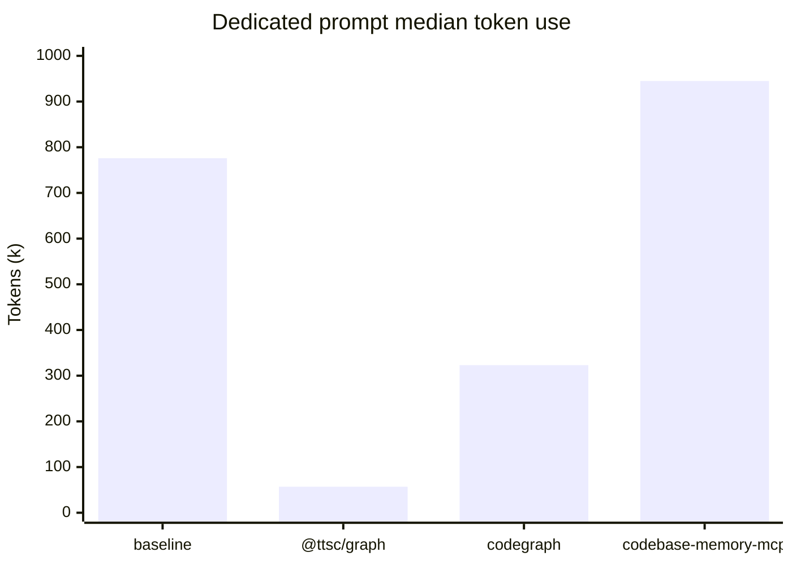

# `@ttsc/graph`


[](https://github.com/samchon/ttsc/blob/master/LICENSE) [](https://www.npmjs.com/package/@ttsc/graph) [](https://www.npmjs.com/package/@ttsc/graph) [](https://github.com/samchon/ttsc/actions?query=workflow%3Atest) [](https://ttsc.dev/docs/graph) [](https://discord.gg/E94XhzrUCZ)

Gives your AI coding agent a **map of your TypeScript codebase**, over MCP, so it answers "how does this work?" without opening file after file.

Ask an agent like Claude Code or Codex about your project and it works file by file: open one, follow an import, open the next, until it has pieced the picture together by hand. Slow, token-hungry, and every relationship is a guess from reading text.

`@ttsc/graph` hands it the map up front: what calls what, what depends on what, where each piece lives. Drawn by the real TypeScript compiler, so it is exact, not skimmed.

On a public benchmark, an agent answered while reading **zero files**, cutting tokens by **77% to 86%** and tool calls by **94% to 95%** (see the [benchmark](https://ttsc.dev/docs/benchmark/graph)).

You can also browse the whole map. This is TypeORM in 3D, colored by kind ([live viewer](https://ttsc.dev/docs/graph/viewer)):

[](https://ttsc.dev/docs/graph/viewer)

## Setup

### Install

```bash
npm install -D ttsc @ttsc/graph typescript@rc
```

`@ttsc/graph` reads the map from the program `ttsc` already type-checked, so install the two together.

### Connect your agent

Add the server to your agent's MCP config, once.

For Claude Code, that is a `.mcp.json` in your project root:

```json
{
  "mcpServers": {
    "ttsc-graph": {
      "command": "npx",
      "args": ["-y", "@ttsc/graph"]
    }
  }
}
```

Start your agent from your project root so the server finds your `tsconfig.json`. The agent queries the map on its own; you never call it by hand.

### Browse it in 3D

Run this in your own project to open that 3D map in your browser, served from a local port:

```bash
npx @ttsc/graph view
```

## Benchmark

On the current GPT 5.4 Mini snapshot, the published median token cost is lowest with `@ttsc/graph`. Values below are thousands of tokens from `website/public/benchmark/graph.json`.





See the [full benchmark page](https://ttsc.dev/docs/benchmark/graph) for the raw rows and method.

## Sponsors

[](https://github.com/sponsors/samchon)

Thanks for your support.

Your [donation](https://github.com/sponsors/samchon) encourages `ttsc` development.

## References

`@ttsc/graph` is inspired by [codegraph](https://github.com/colbymchenry/codegraph), which first put a code graph in front of an agent over MCP. The [benchmark](https://ttsc.dev/docs/benchmark/graph) here is a faithful port of codegraph's.

The difference is where the map comes from. codegraph parses the shape of your code and infers how the pieces connect, while `@ttsc/graph` asks the real TypeScript compiler, which has already resolved every import and reference, so the map is exact rather than inferred.
