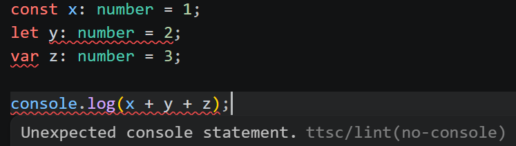

# ttsc for VS Code


[](https://github.com/samchon/ttsc/blob/master/LICENSE) [](https://www.npmjs.com/package/@ttsc/vscode) [](https://www.npmjs.com/package/@ttsc/vscode) [](https://github.com/samchon/ttsc/actions?query=workflow%3Atest) [](https://ttsc.dev/docs) [](https://discord.gg/E94XhzrUCZ)

Bring [`ttsc`](https://ttsc.dev) plugin diagnostics into VS Code.

When `@ttsc/lint` or another LSP-capable `ttsc` plugin like `typia` reports a compile-time diagnostic, this extension shows it in the editor next to normal TypeScript errors.

Use it when the project already runs `ttsc`. Add `@ttsc/lint` when you also want lint diagnostics, fix-all actions, and formatting in the editor.



## Requirements

- **VS Code** 1.94 or later.
- **Node.js** 18 or later.
- A workspace with `tsconfig.json` or `jsconfig.json`.
- Project-installed `ttsc`, `@typescript/native-preview`, and the `ttsc` plugins you want editor diagnostics from.

Install the common project dependencies:

```bash
npm install -D ttsc @typescript/native-preview @ttsc/lint
```

`@ttsc/lint` is optional for TypeScript-Go language features, but required for the lint and format commands shown below.

## Install

Install from the VS Code Marketplace by searching `ttsc` and choosing the extension by `samchon`.

From a shell, the short installer is:

```bash
npx @ttsc/vscode
```

The direct VS Code CLI form is:

```bash
code --install-extension samchon.ttsc
```

To uninstall the npm-installed copy:

```bash
npx @ttsc/vscode uninstall
```

Both shell commands use the `code` CLI. If it isn't on your `PATH`, run **Shell Command: Install 'code' command in PATH** from VS Code's command palette.

## Configuration

### `lint.config.ts`

At the project root, this drives both the lint rules and the formatter. Without it the extension still type-checks, but `@ttsc/lint` diagnostics and formatting do nothing:

```ts
// lint.config.ts
import type { ITtscLintConfig } from "@ttsc/lint";

export default {
  rules: {
    "no-var": "error",
    "prefer-const": "error",
    "typescript/no-explicit-any": "warning",
    "typescript/no-floating-promises": "error",
  },
  format: {
    printWidth: 100,
    singleQuote: true,
    trailingComma: "all",
  },
} satisfies ITtscLintConfig;
```

### `.vscode/settings.json`

Set `samchon.ttsc` as the default formatter and turn on `editor.formatOnSave`:

```jsonc
{
  "[typescript][typescriptreact]": {
    "editor.defaultFormatter": "samchon.ttsc",
    "editor.formatOnSave": true
  }
}
```

Lint fixes stay off-save by default because they can change code meaning. Run `ttsc: Fix all lint issues` from the command palette, or opt in on manual saves:

```jsonc
{
  "editor.codeActionsOnSave": {
    "source.fixAll.ttsc": "explicit"
  }
}
```

## What it adds

- TypeScript-Go diagnostics, hover, navigation, and completions.
- `@ttsc/lint` diagnostics and code actions, including `source.fixAll.ttsc`.
- Diagnostics reported by other LSP-capable `ttsc` plugins.
- `ttsc: Fix all lint issues`, `ttsc: Format document`, and `ttsc: Restart language server` in the command palette.
- Format on save with the `format` block from `lint.config.*`.
- Multi-root workspace support. Each package can use its own `ttsc`, `@typescript/native-preview`, `tsconfig.json`, and `lint.config.*`.

Save the file before relying on lint diagnostics or running the command-palette lint and format commands. Format-on-save works on the live editor buffer.

## Troubleshooting

No diagnostics? Work through these in order:

1. Confirm the workspace has a `tsconfig.json` or `jsconfig.json`.
2. Confirm `ttsc` resolves in the project: `npx ttsc --version`.
3. Confirm the project itself checks: `npx ttsc --noEmit`.
4. Open **View → Output → ttsc** and read the server log.
5. For full LSP tracing, set `ttsc.trace.server` to `"verbose"` and reload the window.

## Sponsors

[](https://github.com/sponsors/samchon)

Thanks for your support.

Your [donation](https://github.com/sponsors/samchon) encourages `ttsc` development.
