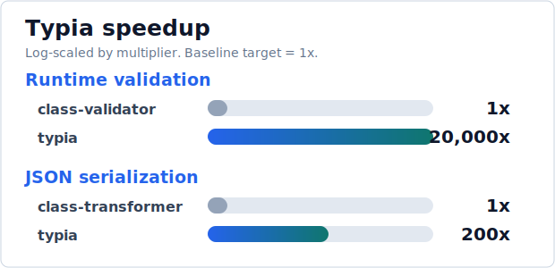
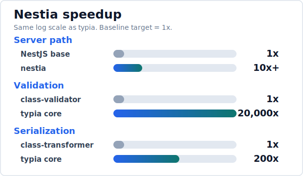
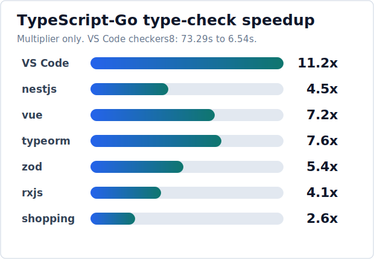
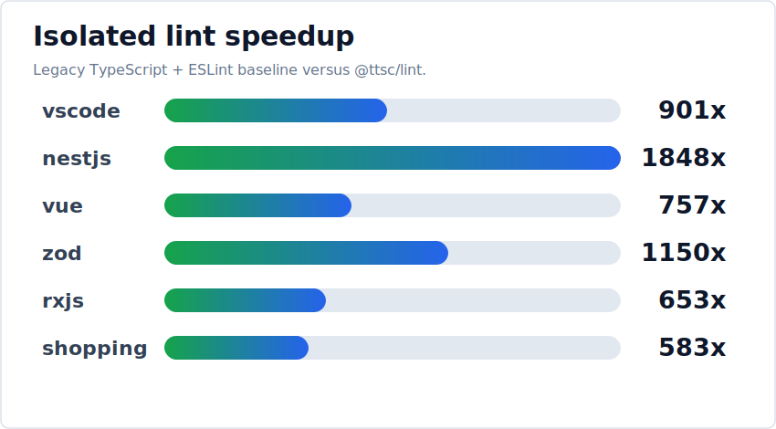
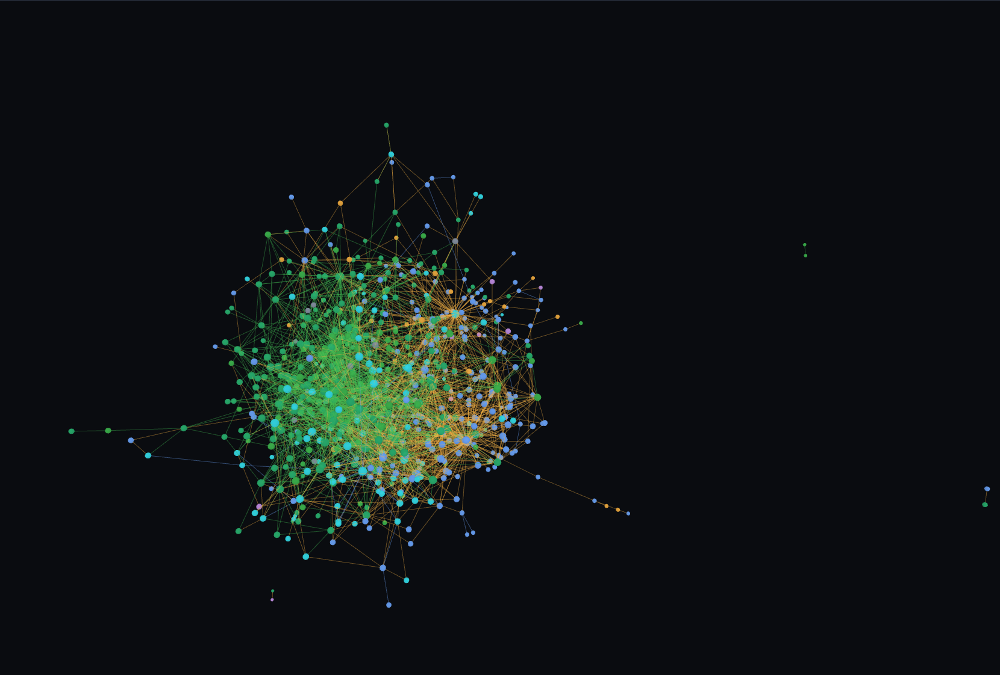
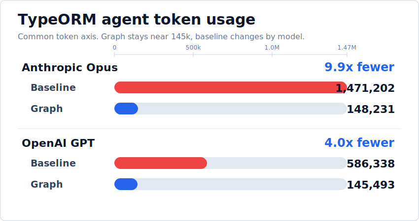

<!-- _class: lead -->

# TTSC

### From Transformer Crisis to TypeScript-Go Toolchain

TypeScript Backend Meetup

Samchon, 2026-06-26

<!--
Hello everyone. I am Samchon, and today I want to talk about TTSC: how it started from a transformer crisis, and why it is becoming a TypeScript-Go based toolchain.

The short version is this. TypeScript-Go is a very good thing for TypeScript users because it makes the compiler much faster. But for projects that depended on TypeScript compiler transformers, it also removes the old JavaScript patch point. TTSC is my answer to that gap.

I will keep the slides light, so please treat the bullet points as anchors. The real story is the chain from Typia and Nestia, to the TypeScript-Go shock, to TTSC as a transformer host, and then to TTSC as a shared compiler-state platform.
-->

---


- https://ttsc.dev
- https://github.com/samchon/ttsc

<!--
These are the two links you can use after the talk. The website is the product-level documentation, and the GitHub repository is where the compiler host, runtime path, language server path, linter, and graph packages live.

I am not going to make this a marketing talk. I will show the original backend problems first, then the compiler problem, then the shape of the solution. If you want to check exact commands or package names later, start from these links.
-->

---

# TL;DR

- Typia and Nestia
  - pure TypeScript input
  - generated runtime/tooling output
- TypeScript-Go
  - faster compiler
  - missing JavaScript patch point
- TTSC
  - transformer host
  - compiler-state toolchain

<!--
Let me start with the whole talk in one slide.

First, Typia and Nestia are examples of a style I have been building for years: the developer writes ordinary TypeScript types and backend code, and the toolchain generates runtime validation, serialization, SDKs, OpenAPI documents, and other artifacts.

Second, TypeScript-Go changes the ground under that model. It gives us a faster compiler, but the old transformer mechanism depended on the JavaScript implementation of the compiler. When the compiler moves to Go, that patch model is no longer enough.

Third, TTSC is the recovery path. At minimum, it is a transformer host for the new compiler world. But once TTSC owns the compiler state, it can also support linting, graph queries, runtime execution, and editor integration without rebuilding the same TypeScript world again and again.
-->

---

# Index

1. Typia and Nestia
2. TypeScript-Go
3. Transformer Survival
4. Toolchain Opportunity

<!--
The talk has four chapters.

The first chapter explains why transformers matter, using Typia and Nestia as concrete backend examples. I want everyone to see the real value before I talk about compiler internals.

The second chapter starts with the good news: TypeScript-Go makes the compiler much faster, so everyday TypeScript work gets better.

Then the chapter turns: the compiler implementation moves from JavaScript to Go, and the old transformer host model stops being a stable foundation.

That is the breakage point. For typia and nestia, the visible TypeScript API can remain, while the generated runtime artifacts lose their engine.

The third chapter explains TTSC as a survival layer. It gives transformers a new front door on top of the TypeScript-Go compiler.

The fourth chapter is the larger opportunity. If one tool already has the Program, AST, Checker, and diagnostics, we should reuse that compiler state for more than emit.
-->

---

<!-- _class: cards -->

# 1. Typia and Nestia

- 1.1. Typia
- 1.2. Nestia
- 1.3. Common Engine
- 1.4. Transformer

<!--
I will begin with Typia and Nestia because they are the reason this problem matters to me.

Instead of starting with "what is a transformer," I want to show what backend developers get from this style of tooling. We will look at the source code the user writes, the output that the compiler creates, and then we will name the common engine behind it.

The important point is that the user experience stays TypeScript-native. The user does not write a separate schema language, a separate validation DSL, or a separate API contract file. The TypeScript program itself is the source of truth.
-->

---

<!-- _class: code-split -->

# 1.1. Typia

- Generic call
  - type argument
  - erased later
- Compiler output
  - direct predicate
  - plain JavaScript

```typescript
//----
// TypeScript
//----
const isString = typia.createIs<string>();

//----
// JavaScript (Compiled)
//----
const isString = (input) => "string" === typeof input;
```

<!--
Before the larger IMember example, this is the smallest shape of the idea.

On the TypeScript side, the user writes a generic function call. The type argument is string, and the call sits on the right-hand side of an ordinary assignment.

On the JavaScript side, the generic call is gone. The generated value is a direct predicate. This is the whole point of typia in the smallest possible form: read the type before erasure, then emit plain JavaScript.
-->

---

<!-- _class: code-split -->

# 1.1. Typia

- User writes
  - TS type
  - tags
  - generic call
- No duplicate
  - no schema
  - no decorator
  - no DTO class

```typescript
import typia, { tags } from "typia";

interface IMember {
  id: string & tags.Format<"uuid">;
  email: string & tags.Format<"email">;
  age: number &
    tags.Type<"uint32"> &
    tags.ExclusiveMinimum<19> &
    tags.Maximum<100>;
}

const isMember =
  typia.createIs<IMember>();
```

<!--
Here is a small typia example.

The user writes a normal TypeScript interface. The id is a string, but it is refined with a UUID tag. The email is a string refined with an email tag. The age is a number refined as an unsigned 32-bit integer, with a minimum and maximum range.

The important part is what is missing. There is no JSON Schema file. There is no decorator-based DTO class. There is no runtime object that describes this type. The single source is the TypeScript type, including the tag metadata.

Then the user calls typia.createIs<IMember>(). At runtime, TypeScript types are normally erased, so this call should have no way to know what IMember is. The only way this can work with full precision is that a compile-time tool reads the compiler's type information and generates JavaScript before the type disappears.
-->

---

<!-- _class: code-split -->

# 1.1. Typia

- Compiler emits
  - UUID check
  - email check
  - uint32 check
  - range check
- Erased type
  - JS
  - no interpreter

```javascript
const isMember = (input) =>
  "object" === typeof input &&
  null !== input &&
  "string" === typeof input.id &&
  _isFormatUuid(input.id) &&
  "string" === typeof input.email &&
  _isFormatEmail(input.email) &&
  "number" === typeof input.age &&
  _isTypeUint32(input.age) &&
  19 < input.age &&
  input.age <= 100;
```

<!--
This is the kind of JavaScript output that typia emits.

The generic call has disappeared. Instead, the emitted code is a direct predicate specialized for IMember. It checks that the input is an object, that id and email are strings, that they match the requested formats, and that age satisfies the integer and range constraints.

This matters because the generated function is ordinary JavaScript. It does not interpret a schema at runtime. It does not reflect on decorators. It does not allocate a validation tree before checking a value. It is just the exact set of checks needed for this type.

So the transformer is doing two jobs. It captures type information before erasure, and it turns that information into runtime code that V8 can optimize like handwritten code.
-->

---

<!-- _class: benchmark -->

# 1.1. Typia

- Runtime validation
  - **20,000x**
  - `class-validator`
  - detailed failure paths
- JSON serialization
  - **200x**
  - `class-transformer`
  - type-specialized stringifier
- Same source
  - TypeScript type
  - JSDoc
  - tags



<!--
This is why typia has such a large practical impact in backend systems.

Runtime validation usually sits on hot boundaries: incoming requests, outgoing responses, message queues, configuration, and database-facing data. If the validator is slow, the cost appears everywhere. typia can be much faster than decorator and reflection based validators because the generated function has no generic interpreter in the middle.

The same idea applies to JSON serialization. If the compiler knows the exact output shape, it can generate a stringifier specialized for that shape. That is different from walking arbitrary objects with a general-purpose serializer.

The numbers on the slide are intentionally simple: validation can reach the 20,000x class against class-validator in benchmark cases, and serialization can reach the 200x class against class-transformer. The exact ratio changes by shape and environment, but the architectural reason is stable: type-specialized generated code beats runtime interpretation.
-->

---

<!-- _class: code-split -->

# 1.2. Nestia

- Backend code
  - path
  - method
  - parameter
  - body type
  - return
- Contract source
  - controller

```typescript
@Controller("bbs/:section/articles")
export class BbsArticlesController {
  @TypedRoute.Post()
  public async create(
    @TypedParam("section") section: string,
    @TypedBody() input: IBbsArticle.ICreate,
  ): Promise<IBbsArticle> {
    return this.service.create(section, input);
  }
}
```

<!--
Now let us move from a single type to an HTTP boundary.

This nestia example is a normal NestJS controller. The path is on the controller. The HTTP method is on the route decorator. The path parameter is typed. The request body is typed. The return value is a Promise of a typed article.

From a backend developer's view, this is just controller code. But it also contains the API contract. The method signature tells us the endpoint, the input, the output, and the runtime boundary where validation and serialization should happen.

That is the important design choice. The controller is not merely implementation. It is the source from which the client SDK, OpenAPI document, validation code, serialization code, mock data, and tests can be generated.
-->

---

<!-- _class: code-split -->

# 1.2. Nestia

- Generated SDK
  - typed fetch
  - DTO
  - checks
- Backend
  - no interface copy
  - FE API

```typescript
const article: IBbsArticle =
  await api.functional.bbs.articles.create(
    connection,
    "general",
    {
      title: "Hello World",
      body: "My first article",
    } satisfies IBbsArticle.ICreate,
  );
```

<!--
Here is the other side of the same contract.

nestia can generate a frontend SDK function from the backend controller. The frontend calls api.functional.bbs.articles.create with a connection, the section parameter, and a body that satisfies the DTO type.

This removes one of the most common backend-to-frontend failure modes: copying an API contract by hand. The frontend does not need to guess the path string, request body shape, response type, or parameter order. Those are generated from the backend source.

This is also why the transformer problem is bigger than one function call. Once this generation path works, it becomes part of the product workflow. Backend code, runtime checks, SDK generation, OpenAPI, and client typing all depend on compiler-level analysis.
-->

---

<!-- _class: benchmark -->

# 1.2. Nestia

- Server performance
  - **10x+** total path
  - **30x** Fastify path
  - validation **20,000x**
  - serialization **200x**
- SDK generation
  - typed fetch functions
  - DTO structures
  - npm distribution
- Tooling
  - OpenAPI
  - mockup simulator
  - E2E test functions
  - Swagger editor



<!--
nestia takes the same compiler-driven idea and applies it to a larger backend workflow.

On the server path, it combines generated validation and serialization with a typed routing model, so the request and response boundary becomes faster and more reliable. The slide shows the simple headline numbers: over 10x for the total server path in relevant benchmarks, 30x on the Fastify path, and the typia core numbers for validation and serialization.

But performance is only one part. nestia also generates typed fetch functions, DTO structures, OpenAPI documents, mockup simulators, E2E test functions, and a Swagger editor path. These are all contract artifacts that backend teams usually maintain through separate tools.

So the lesson is not "nestia is a faster router." The lesson is that once TypeScript compiler facts become available to the toolchain, one backend source can produce a whole API surface.
-->

---

# 1.3. Common Engine

- typia
  - TypeScript type
  - Runtime validator
  - JSON serializer
  - LLM schema
- nestia
  - NestJS controller
  - Runtime boundary
  - client SDK
  - OpenAPI document
- Same shape: compiler analysis, generated artifacts

<!--
Let us summarize the pattern before going deeper.

typia starts from a TypeScript type and produces runtime validators, JSON serializers, LLM schemas, and other runtime artifacts. nestia starts from a NestJS controller and produces runtime boundary checks, frontend SDKs, OpenAPI documents, and test utilities.

The products look different, but the shape is the same. The user writes TypeScript. The tool reads compiler facts. The output is generated code or generated metadata that would be hard, slow, or unreliable to write by hand.

That common shape is why the compiler host matters. If the compiler cannot expose enough information at the right time, these tools lose the engine that makes them TypeScript-native.
-->

---

# 1.3. Common Engine

- Input
  - TypeScript source
  - types
  - decorators
  - JSDoc
- Compiler facts
  - AST
  - Checker
  - symbols
  - diagnostics

<!--
The common engine has three layers.

The input layer is the user's TypeScript source: types, decorators, JSDoc, imports, and function calls. This is the code the developer already wants to maintain.

The compiler facts layer is what makes the output precise. The AST tells us syntax. The Checker tells us resolved types, symbols, constraints, and relationships. Diagnostics tell us when the program is not valid enough to trust.

The output layer is where product value appears: JavaScript emit, JSON schemas, SDK functions, OpenAPI documents, and plugin diagnostics. The transformer is the bridge between the compiler facts and those outputs.
-->

---

# 1.4. Transformer

- Transformer
  - compile-time code generation
  - from TypeScript compiler facts
- Reads
  - source file
  - AST
  - Checker
- Re-writes
  - JavaScript emit
  - diagnostics
  - generated artifacts

<!--
Now we can name the technique.

A transformer is compile-time code generation using compiler facts. It is not just a text replacement. It reads source files and AST nodes, asks the Checker what types and symbols mean, and then changes the emitted JavaScript or creates side artifacts.

For typia, the transformer replaces generic function calls with specialized runtime functions. For nestia, the transformer extracts controller contracts and generates SDKs and documents. Other projects use transformers for dependency injection, metadata, optimization, or custom diagnostics.

The critical requirement is timing. The transformer must run while the compiler still has the type information. After emit, the JavaScript no longer contains the TypeScript types in a useful form.
-->

---

<!-- _class: code-split -->

# 1.4. Transformer

- Project setup
  - install `ts-patch`
  - hack TypeScript
- Compiler config
  - transformer path

```jsonc
// tsconfig.json
{
  "compilerOptions": {
    "plugins": [
      { "transform": "typia/lib/transform" },
      { "transform": "@nestia/core/lib/transform" },
      { "transform": "@nestia/sdk/lib/transform" }
    ]
  }
}

// package.json
{
  "scripts": {
    "prepare": "ts-patch install"
  },
  "devDependencies": {
    "ts-patch": "^3.2.1"
  }
}
```

<!--
This is the part that must be visible before the TypeScript-Go story.

In the old setup, using a transformer was more than a library import. The project installed ts-patch, registered transformer module paths in tsconfig, and put ts-patch install into the package lifecycle so the local TypeScript package was patched again after install.

That means the working model depended on mutating the installed TypeScript package. It was a practical hack: make TypeScript load transformer modules during compilation, then typia and nestia can run before type erasure.
-->

---

# 1.4. Transformer

- Public API
  - still TypeScript
  - still npm package
  - still framework-friendly
- Private engine
  - JavaScript compiler process
  - transformer host
  - emit pipeline
- Key split
  - language compatibility
  - plugin compatibility

<!--
Here is the hidden dependency in this whole model.

From the outside, Typia and Nestia still feel like ordinary TypeScript packages. The public API is TypeScript code. The package is installed from npm. It fits inside existing backend frameworks.

Internally, however, the engine depended on the old JavaScript compiler process. The transformer host, compiler API objects, emit pipeline, and patch points were all available as JavaScript objects in a JavaScript process.

That creates an important split. A new compiler can remain compatible with the TypeScript language and still break transformer compatibility. TypeScript code can still type-check, while the plugin system that generated the runtime artifacts disappears.
-->

---

<!-- _class: lead -->

# 2. TypeScript-Go

- 2.1. Native Compiler
- 2.2. Patch Model
- 2.3. Broken Assumption
- 2.4. Project Risk

<!--
Chapter 2 has to start fairly.

TypeScript-Go is not a villain in this story. It is the thing TypeScript users have wanted for years: a much faster compiler and language service. The first point is the upside: type-checking gets faster, editor feedback gets faster, and CI gets a real chance to shrink.

Then the chapter turns on one implementation detail. The source language remains TypeScript, but the compiler implementation language changes from JavaScript to Go.

That sounds internal, but the transformer ecosystem lived inside the old internal shape. It patched a JavaScript package, loaded JavaScript modules, touched JavaScript compiler objects, and rode the JavaScript emit pipeline.

So the crisis is not "TypeScript-Go cannot understand TypeScript." The crisis is "the old JavaScript transformer host disappears." For typia and nestia, that means the public API can still look alive while the generated product value dies.
-->

---

<!-- _class: cards -->

# 2.1. Native Compiler

- User-visible promise
  - same TypeScript source
  - same project files
  - faster check loop
- Implementation change
  - compiler rewritten in Go
  - language service moves native
  - JavaScript package is no longer the center
- First reaction
  - this is excellent news

<!--
This slide is deliberately positive.

For ordinary TypeScript users, the pitch is simple. Keep the same source language, keep the same project model, and get a much faster compiler and language service.

That is a real improvement. Backend projects, monorepos, editors, and CI pipelines all pay the TypeScript check cost every day.

The key phrase is "same TypeScript, different compiler implementation." The source language remains familiar, but the runtime that compiler-powered tools used to patch is no longer the same runtime.
-->

---

<!-- _class: benchmark -->

# 2.1. Native Compiler

- Benchmark headline
  - VS Code: **11.2x**
  - 73.29s to 6.54s
- Pattern
  - fixture set repeats the win
  - speed comes from the native compiler base



<!--
This is the graph that makes the upside credible.

The VS Code row is the important anchor: legacy TypeScript takes about 73.29 seconds in the published check benchmark, while the TypeScript-Go checkers8 row is about 6.54 seconds. That is 11.2x faster.

The other fixture rows keep the same pattern. The exact multiplier changes by project, but the direction does not: TypeScript-Go makes the type-check loop materially faster.

Most rows use the raw tsgo checkers8 comparison. The shopping-backend snapshot has no raw tsgo noEmit row, so this chart uses the ttsc checkers8 row there because it is still backed by TypeScript-Go. The slide shows only multipliers because the narrative point is the size of the speedup, not a stopwatch table.
-->

---

<!-- _class: flow -->

# 2.2. Patch Model

- JavaScript compiler
  - `typescript` from npm
  - `Program`
  - `TypeChecker`
  - `SourceFile`
- JavaScript patch
  - `ttypescript`
  - `ts-patch`
  - `tsconfig.plugins`
- JavaScript transformer
  - load module
  - inspect types
  - rewrite emit

<!--
This is the old world as a pipeline.

The compiler came from npm as JavaScript. The build process ran JavaScript. The Program, TypeChecker, SourceFile, AST nodes, diagnostics, and emit pipeline were all JavaScript objects.

That made the transformer model possible. ttypescript and ts-patch did not create a clean official plugin system, but they could patch the JavaScript compiler and load JavaScript transformer modules into the same process.

That is why the model worked. The compiler and the plugin lived in the same language runtime. The transformer could look at compiler objects, ask the checker questions, and replace emitted code.
-->

---

<!-- _class: cards -->

# 2.2. Patch Model

- What users configured
  - `ts-patch install`
  - `plugins` in `tsconfig.json`
  - transformer package path
- What tools assumed
  - patched TypeScript is executable
  - JavaScript module can enter emit
  - compiler API objects are reachable
- What typia and nestia used
  - type facts before erasure
  - controller facts before runtime
  - generated code during emit

<!--
This slide names the hidden contract.

The user sees a small setup: install a patch, list plugins in tsconfig, and run the compiler through the patched path. That looks like configuration.

Under that setup, the tools assume much more. They assume the TypeScript package can be patched. They assume the compiler can load a JavaScript transformer module. They assume compiler API objects are in process and reachable.

Typia and nestia used that access to catch facts before they disappear. Typia catches type facts before erasure and emits validators and serializers. Nestia catches controller facts before runtime and emits SDKs, OpenAPI documents, mockups, and test helpers.
-->

---

# 2.3. Broken Assumption

```json
{
  "compilerOptions": {
    "plugins": [
      { "transform": "typia/lib/transform" },
      { "transform": "@nestia/core/lib/transform" },
      { "transform": "@nestia/sdk/lib/transform" }
    ]
  }
}
```

<!--
This is where the old model starts to fail.

The tsconfig entry still looks ordinary. The package names are still JavaScript package names. The user can still write the same TypeScript application code.

But this configuration only means something if the compiler process can load those JavaScript modules and let them participate in emit.

That was natural when the compiler process was JavaScript. It is not natural when the compiler implementation becomes a native Go compiler. The source language is still TypeScript, but the plugin host assumed by this JSON no longer exists automatically.
-->

---

<!-- _class: compare -->

# 2.3. Broken Assumption

| Question | Old TypeScript | TypeScript-Go |
| --- | --- | --- |
| source language | TypeScript | TypeScript |
| compiler implementation | JavaScript | Go |
| plugin loading | JavaScript module in-process | no old JS host |
| transformer access | Program, Checker, emit hook | bridge required |
| result | generated artifacts | typia/nestia engine at risk |

<!--
This table is the point of chapter 2.

Language compatibility and transformer compatibility are different problems.

TypeScript-Go can preserve the source language and still break the old transformer execution model. The reason is simple: the old model was not just TypeScript syntax. It was JavaScript modules running inside a JavaScript compiler process.

Once the compiler implementation moves to Go, transformer access needs a bridge. Without that bridge, the TypeScript source may still be valid, while generated validators, serializers, SDKs, and OpenAPI documents stop appearing.
-->

---

<!-- _class: cards three -->

# 2.4. Project Risk

- typia
  - `createIs<T>()` needs erased type facts
  - no transformer, no specialized predicate
  - no generated serializer path
- nestia
  - controllers need compile-time extraction
  - no transformer, no SDK contract
  - no OpenAPI or mockup pipeline
- Product failure
  - packages can still install
  - source can still look valid
  - generated value disappears

<!--
This is the crisis in practical terms.

Typia is not valuable because it exposes a function name. It is valuable because the transformer sees erased type facts and turns them into specialized runtime code. Without that transformer path, the API can remain on npm while the generated predicate and serializer path disappear.

Nestia is the same kind of problem at the application boundary. It extracts controller contracts and turns them into SDKs, OpenAPI documents, mockups, and E2E helpers. Without the transformer path, the source of truth is still in the TypeScript code, but the compiler no longer delivers it to the generator.

That is why this is not a minor compatibility issue. The visible package can survive while the product engine is gone.
-->

---

<!-- _class: cards choice -->

# 2.4. Project Risk

- Wait
  - upstream plugin model
  - unknown timing
- Retreat
  - runtime schemas
  - duplicate source of truth
- Shrink
  - remove generated features
  - lose the reason users came
- Build
  - new transformer host
  - survive on TypeScript-Go

<!--
This final slide sets up chapter 3.

At this point in the story, the replacement host does not already exist. That is important. The situation is not "TTSC is ready, so let's switch." The situation is "the old host is disappearing, and typia and nestia need a path to stay alive."

The options were bad. Wait for an upstream model with unknown timing. Retreat to runtime schemas and duplicate the source of truth. Shrink the products and remove the generated features that made users choose them.

The remaining option was to build a new transformer host on top of the TypeScript-Go direction. That is where chapter 3 begins: not with a finished toolchain, but with the decision to build the missing host.
-->

---

<!-- _class: lead -->

# 3. Transformer Survival

- 3.1. Compiler Front Door
- 3.2. Plugin Host
- 3.3. Transformer Lifecycle
- 3.4. Runtime and Editor Path

<!--
This is the reversal.

2장에서는 TypeScript-Go가 기존 transformer 생태계를 무너뜨렸습니다. 여기서는 그 뒤에 무엇을 했는지 보여줍니다.

At this point in the story, TTSC is not a finished toolchain waiting on the shelf. The old host is disappearing, and the replacement does not exist yet.

The immediate goal was simple: typia and nestia should not die because the compiler implementation moved. Users should not have to rewrite their applications into runtime schemas, and I should not have to remove the features that made these packages useful.

So the first decision was to build the missing host. The later opportunity comes after that. First, the products have to survive.
-->

---

<!-- _class: cards -->

# 3.1. Compiler Front Door

- Missing piece
  - no patched JavaScript host
  - no plugin entry point
- Required host
  - load the project
  - expose compiler facts
  - run transformers
- Design choice
  - explicit front door
  - tsc-shaped command

<!--
The first thing I needed was not a new product slogan. It was a compiler front door.

The old patched JavaScript compiler host could no longer be the assumption. That meant there had to be a new place where the project is loaded, compiler options are understood, compiler facts are exposed, and transformers can run.

That front door should still feel like tsc to the user. But internally it cannot be a thin alias. It has to be the place where the new compiler world and the old transformer ecosystem meet.
-->

---

<!-- _class: cards -->

# 3.1. Compiler Front Door

- Keep TypeScript-Go
  - native compiler base
  - semantic analysis
  - diagnostics
- Add missing layer
  - transformer host
  - plugin execution path
  - emit integration
- Goal
  - keep products alive
  - move with the compiler

<!--
This design has one important constraint.

The answer cannot be "reject TypeScript-Go and go back to the old JavaScript compiler forever." That would miss the main ecosystem benefit. The native compiler base, semantic analysis, diagnostics, and performance direction are the reason to build this.

The layer I needed to build goes around that compiler base. It provides a transformer host, a plugin execution path, and emit integration so that transformer-powered packages can stay alive while users still benefit from the faster compiler direction.

That was the design constraint: keep the products alive without asking the ecosystem to reject the faster compiler. The answer could not be nostalgia for the old patch model. It had to be compatibility with the future.
-->

---

<!-- _class: compare -->

# 3.2. Plugin Host

| Old                            | TTSC                         |
| ------------------------------ | ---------------------------- |
| Patch TypeScript install       | Explicit compiler front door |
| JS compiler process            | TypeScript-Go base           |
| JS transformer loaded directly | Plugin host bridge           |
| Build-time only                | Build, runtime, editor       |

<!--
This table compares the old host and the TTSC host.

The old model patched the TypeScript installation. TTSC makes the compiler front door explicit. Instead of hoping the installed TypeScript package has been modified correctly, the user invokes the toolchain that is designed to host plugins.

The old model loaded JavaScript transformers directly inside a JavaScript compiler process. TTSC needs a bridge because the compiler base is TypeScript-Go while much of the plugin ecosystem is still JavaScript.

The old model was mostly a build-time story. TTSC expands the same idea into build, runtime execution, and editor feedback, because plugin-aware diagnostics are most useful before CI fails.
-->

---

<!-- _class: flow -->

# 3.2. Plugin Host

- Project owner
  - load project once
  - keep Program state
- Plugin package
  - discovered
  - built
  - cached
- Bridge
  - TypeScript-Go facts
  - transformer execution
  - emit output

<!--
The plugin host has three responsibilities.

First, it is the project owner. It loads the project once, holds the Program state, and understands the compiler options and source graph.

Second, it manages plugin packages. A plugin must be discovered, built if needed, cached when possible, and connected to the right project state. This keeps plugin startup from becoming a separate tax every time.

Third, it is the bridge. It connects TypeScript-Go compiler facts to transformer execution and then connects transformer results back to emit output and diagnostics. The bridge is the part that replaces the old "everything is JavaScript in one process" assumption.
-->

---

<!-- _class: flow -->

# 3.3. Transformer Lifecycle

- Input
  - source files
  - declarations
  - compiler options
- Compiler facts
  - AST
  - Checker
  - diagnostics
- Output
  - generated JavaScript
  - rewritten emit
  - plugin diagnostics

<!--
The transformer lifecycle still looks familiar at the conceptual level.

The input is source files, declarations, compiler options, and project configuration. The compiler facts are AST nodes, checker results, symbols, diagnostics, and type relations.

The output can be generated JavaScript, rewritten emit, generated side files, and plugin diagnostics. For typia, that output is specialized validation or serialization code. For nestia, it can be SDK and OpenAPI artifacts.

What changes in TTSC is not the idea of transformation. What changes is who owns the lifecycle and how compiler facts cross the boundary between the TypeScript-Go compiler world and the JavaScript plugin world.
-->

---

<!-- _class: cards three -->

# 3.3. Transformer Lifecycle

- typia user
  - `typia.createIs<T>()`
  - no runtime schema
- nestia user
  - `@TypedRoute`
  - generated SDK
- Internal shift
  - old patch removed
  - TTSC host added

<!--
From the user's point of view, the ideal migration is boring.

A typia user should still write typia.createIs<T>(). A nestia user should still write @TypedRoute and typed DTOs. They should not be forced to rewrite their application into runtime schema objects just because the compiler implementation changed.

The internal shift is the important part. The old patch is removed. TTSC becomes the host. The user API stays TypeScript-native while the toolchain underneath moves from a patched JavaScript compiler to a TypeScript-Go based compiler host.

That separation is the whole survival strategy: preserve the surface that users depend on, replace the engine that can no longer be assumed.
-->

---

<!-- _class: cards -->

# 3.4. Runtime and Editor Path

```bash
npx ttsx src/index.ts
```

- `tsx` convenience
  - direct TypeScript execution
- Type safety
  - real check
  - plugin-aware path
- Avoid
  - transpile-only blind spot

<!--
Runtime execution is another place where this matters.

Developers like tools such as tsx because they can execute TypeScript files directly. That is convenient for scripts, local servers, tests, and small tools.

But a transpile-only path can create a blind spot. If runtime execution ignores type checking or plugin behavior, the code that runs locally may not match the code that the real compiler would produce.

ttsx is the TTSC answer for that path. The goal is direct TypeScript execution with a real check and a plugin-aware pipeline, so runtime convenience does not silently bypass the transformer system.
-->

---

<!-- _class: cards -->

# 3.4. Runtime and Editor Path

- `@ttsc/vscode`
  - plugin diagnostics
  - code actions
  - plugin commands
- VS Code Plugin
  - project view
  - early feedback
- Goal
  - CI confirms
  - editor discovers

<!--
The editor path is just as important as the build path.

If transformer plugins can produce diagnostics, code actions, or plugin commands, developers should see that feedback in the editor. Waiting for CI means the feedback loop is already too late.

@ttsc/vscode is the VS Code Plugin side of the toolchain. The goal is that VS Code can show plugin-aware diagnostics and commands in the project view, using the same compiler understanding that build and runtime paths rely on.

The ideal workflow is simple: the editor discovers problems early, local commands verify them, and CI confirms the same behavior.
-->

---

<!-- _class: cards -->

# 3.4. Runtime and Editor Path

- Build
  - `ttsc`
  - transformer emit
- Runtime
  - `ttsx`
  - checked execution
- VS Code Plugin
  - `@ttsc/vscode`
  - plugin diagnostics
- One toolchain
  - not one wrapper

<!--
This is the whole loop.

ttsc covers build and type-checking. ttsx covers checked runtime execution. @ttsc/vscode covers editor diagnostics and actions in VS Code. Together they form one plugin-aware toolchain.

The phrase "one toolchain" is important. If each surface built a separate TypeScript world, we would pay the compiler cost repeatedly and risk inconsistent behavior. The point of TTSC is to share the same compiler understanding across surfaces.

That starts as transformer survival, but it leads naturally to the next chapter: once we own compiler state, what else should use it?
-->

---

<!-- _class: lead -->

# 4. Toolchain Opportunity

- 4.1. Compiler State
- 4.2. @ttsc/lint
- 4.3. @ttsc/graph
- 4.4. From Patch to Toolchain

<!--
The final chapter is about the opportunity beyond survival.

At first, TTSC existed because transformers needed a new host. But after building that host, an obvious question appears: if TTSC already has the Program, AST, Checker, and diagnostics, why should every other tool rebuild that same state?

This is where TTSC becomes more than a transformer wrapper. It can become a compiler-state toolchain for linting, graph queries, editor features, and agent workflows.
-->

---

<!-- _class: cards three -->

# 4.1. Compiler State

- Already loaded
  - Program
  - AST
  - Checker
  - diagnostics
- Expensive to rebuild
  - parse
  - module graph
  - type services
- Reusable by tools
  - transformers
  - linter
  - graph

<!--
The expensive part of TypeScript tooling is often not the final operation. It is loading the project.

The compiler must parse source files, resolve modules, build the dependency graph, compute type relations, and produce diagnostics. Once that work is done, many tools want the same facts.

Transformers need those facts for code generation. Linters need those facts for type-aware rules. Graph tools need those facts to resolve symbols, references, imports, and ownership relationships.

If each tool reloads the project independently, the workflow pays the same cost multiple times. TTSC's opportunity is to load and analyze once, then reuse that state across tools.
-->

---

<!-- _class: flow -->

# 4.1. Compiler State

- Load once
  - project
  - options
  - dependencies
- Analyze once
  - semantic graph
  - diagnostics
  - type relations
- Reuse many times
  - emit
  - lint
  - graph

<!--
This is the core contract I want TTSC to provide.

Load once: read the project, compiler options, dependencies, and source graph. Analyze once: build semantic facts, diagnostics, and type relationships. Reuse many times: emit transformed JavaScript, run lint rules, answer graph queries, and support editor features.

This contract is especially useful in large repositories. The larger the project, the more wasteful it becomes for every tool to start from zero.

So the toolchain is not just about making one command faster. It is about making the whole TypeScript workflow stop duplicating the same compiler work.
-->

---

<!-- _class: lint-benchmark -->

# 4.2. @ttsc/lint



<!--
Linting is the easiest performance example.

In many projects, the normal path is to run tsc --noEmit for type checking and then run ESLint for linting. If ESLint uses type-aware rules, it may construct another TypeScript program or another type world.

The performance page splits lint out because the legacy path is tsc plus ESLint, while the TTSC path can report the native @ttsc/lint timing separately. The graph uses the pure lint-to-lint ratio from that split.

VS Code is no longer the only visible example. The ratio repeats across vscode, nestjs, vue, zod, rxjs, and shopping. NestJS is the largest row here at 1848x, while even the smallest row, shopping, is still 583x.

For backend teams, this matters because linting is part of the same feedback loop as type checking. If the linter can ride on the compiler session that is already loaded, it becomes much easier to keep strict checks enabled locally and in CI.
-->

---

<!-- _class: lint-example -->

# 4.2. @ttsc/lint

<div class="lint-concept">
  <div><strong>Compiler gate</strong><span>Lint rules fail the same build path as type errors.</span></div>
  <div><strong>Diagnostic shape</strong><span>Every finding is rendered as an <code>error TSxxxxx</code>.</span></div>
  <div><strong>One stream</strong><span>Terminal, CI, and editor consume the same output.</span></div>
</div>

<div class="lint-label source-label">src/index.ts</div>
<div class="lint-label terminal-label">npx ttsc --noEmit</div>

```typescript
var x: number = 3;
let y: number = 4;
const z: string = 5;

console.log(x + y + z);
```

```bash
$ npx ttsc --noEmit

src/index.ts:3:7 - error TS2322
Type 'number' is not assignable to type 'string'.

src/index.ts:2:5 - error TS17397 [prefer-const]
Use const instead of let.

src/index.ts:1:1 - error TS11966 [no-var]
Unexpected var, use let or const instead.
```

<!--
This is the example shape from the ttsc.dev lint pages.

The important part is that one run prints a normal TypeScript error, TS2322, and lint rule failures, TS17397 and TS11966, in the same compiler diagnostic format.

That makes lint a compiler failure. The same terminal output, same CI gate, and same editor underline can handle both type errors and lint violations.
-->

---

<!-- _class: graph-shot -->

# 4.3. @ttsc/graph

- Checker facts
  - declarations
  - resolved edges
  - diagnostics
- Agent queries
  - overview
  - query
  - trace / expand
- Goal
  - stop guessing from text



<!--
The same idea applies to code intelligence and agent workflows, but the graph needs a concrete picture.

This is the 3D graph viewer from ttsc.dev. The example shown is the VS Code fixture: 724 declaration nodes and 3,002 resolved edges. Every node is a declaration. Every edge is a relationship reported by the compiler.

That matters because the graph is not a screenshot of files. It is checker-resolved structure: declarations, value-call edges, type-reference edges, heritage edges, and diagnostics attached to the same project view.

Without this, an agent starts with grep and guesses from text. With this, the first move can be graph_overview, graph_query, graph_trace, or graph_expand. The tool starts from compiler facts, then opens source only when the graph has narrowed the target.
-->

---

<!-- _class: graph-token -->

# 4.3. @ttsc/graph



<!--
This benchmark cell shows the practical effect on a TypeORM task.

The first measurement is Anthropic Opus. The baseline path consumed 1,471,202 tokens, while the graph path consumed 148,231 tokens. That is 9.9x fewer tokens.

The second measurement is OpenAI GPT. The baseline path consumed 586,338 tokens, while the graph path consumed 145,493 tokens. That is about 4.0x fewer tokens.

The exact multiplier changes by model and agent behavior, but the direction is the same. When a task depends on symbol relationships, references, or diagnostics, the compiler graph reduces the amount of source browsing needed before the real change can start.
-->

---

<!-- _class: flow -->

# 4.4. From Patch to Toolchain

- Started as survival
  - keep typia alive
  - keep nestia alive
  - keep transformers alive
- Became infrastructure
  - compiler front door
  - plugin host
  - shared compiler state
- Opened new tools
  - lint
  - graph

<!--
This is the story arc of TTSC.

It started as survival. I needed typia, nestia, and transformer-based packages to keep working after the old JavaScript patch point stopped being a reliable future path.

To solve that, TTSC needed a compiler front door, a plugin host, and shared compiler state. Once those pieces existed, the same infrastructure could support more than transformers.

That is how survival became toolchain infrastructure. The host that keeps emit alive can also run lint rules, expose graph queries, support editor feedback, and reduce duplicate compiler work across the backend development loop.
-->

---

<!-- _class: cards -->

# 4.4. From Patch to Toolchain

- Compiler
  - `ttsc`
- Runtime
  - `ttsx`
- VS Code Plugin
  - `@ttsc/vscode`
- Reuse
  - `@ttsc/lint`
  - `@ttsc/graph`

<!--
Here is the surface area in package terms.

ttsc is the compiler command. ttsx is the runtime execution path. @ttsc/vscode is the VS Code Plugin path. @ttsc/lint and @ttsc/graph are examples of tools that reuse the compiler state.

This list is also a way to understand the project boundary. TTSC is not just a transformer loader. It is a TypeScript-Go based toolchain where compiler state is a shared asset.

The practical goal is that backend teams can keep TypeScript-native APIs, get the performance benefits of the new compiler direction, and add tooling that does not rebuild the same semantic world over and over.
-->

---

<!-- _class: cards -->

# Closing

- TypeScript-Go
  - faster compiler
  - new runtime substrate
- Transformers
  - old patch point gone
  - host required
- TTSC
  - transformer survival
  - compiler-state toolchain
- Outcome
  - user API stays TypeScript
  - backend tooling moves forward

<!--
Let me close with the main takeaway.

TypeScript-Go gives us a faster compiler and a new runtime substrate for the TypeScript toolchain. That is good for backend developers because compiler latency is part of everyday work.

But transformer-based tools depended on an old patch point. typia, nestia, and similar projects need a new host if they are going to remain TypeScript-native in the new compiler world.

TTSC is that host, and it is also becoming more than that host. By owning compiler state, it can support transformer emit, runtime execution, editor diagnostics, linting, and graph queries in one toolchain.

The outcome I want is simple: users keep writing TypeScript as the source of truth, and backend tooling moves forward instead of retreating to duplicated schemas or slower runtime interpretation.
-->

---

<!-- _class: cards -->

# Closing

- TypeScript v7
  - official TypeScript-Go era
- TTSC
  - released alongside TypeScript v7
- Goal
  - transformer compatibility
  - shared compiler-state toolchain

<!--
The release target is clear.

When TypeScript v7 is officially released and the TypeScript-Go direction becomes the mainstream compiler path, TTSC should be released with it.

The goal is not to ship a separate experimental side project after the ecosystem has already moved. The goal is to have the transformer host and the compiler-state toolchain ready at the same moment backend teams start evaluating TypeScript v7 seriously.

That is the promise: TypeScript-native APIs should not have to die because the compiler got faster.
-->

---

# Q&A

TypeScript Backend Meetup

2026-06-26

Samchon

<!--
Thank you. I am happy to take questions.

Good topics for Q&A are the TypeScript-Go migration path, transformer compatibility, how Typia and Nestia will use TTSC, what the plugin host boundary looks like, or how @ttsc/lint and @ttsc/graph reuse compiler state.

If you are maintaining a backend tool that depends on the TypeScript compiler API, I am especially interested in what kind of host surface you need. The goal is not just to keep my packages alive, but to make the TypeScript-Go era usable for compiler-powered backend tooling.
-->
