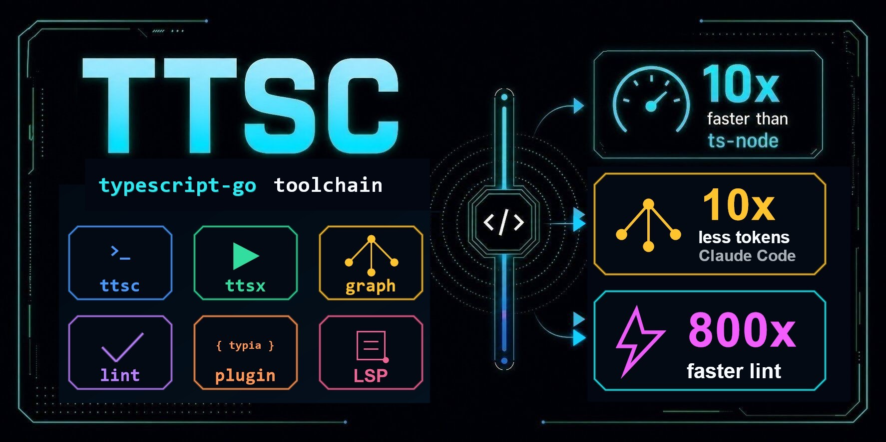

<!-- _class: lead -->

# TTSC

### TypeScript-Go ToolChain

TypeScript Backend Meetup

Samchon, 2026-06-26

<!--
Opening: TypeScript-Go is the trigger. TTSC is the survival layer for transformer users.
-->

---

# TTSC



<!--
One beat for the logo.
-->

---

# TL;DR

- TypeScript compiler is moving to Go

- Transformers lose the old JavaScript patch point

- TTSC keeps compile-time code generation alive

- Linter and Graph turn compiler state into toolchain state

<!--
Say: this talk is not "Go is faster". It is "the compiler substrate changed".
-->

---

# Preface

TypeScript 7 changes the foundation under TypeScript tools.

- Native Go compiler

- TypeScript 6 semantic parity

- About **10x** faster on many projects

- Plugin ecosystem must adapt

<!--
Source is Microsoft's TypeScript 7 RC and native port posts.
-->

---

# Index

1. TypeScript-Go

2. TTSC

3. TTSC Linter

4. TTSC Graph

<!--
Four chapters. Problem first, TTSC after.
-->

---

<!-- _class: lead -->

# 1. TypeScript-Go

- Good News

- Bad News

- Transformer

- Compatibility Gap

<!--
Chapter start is only the local table of contents.
-->

---

# 1.1. Good News

TypeScript compiler is moving from JavaScript to Go.

- TypeScript 7.0 RC

- Native compiler and language service

- Shared-memory parallelism

- About **10x** faster than TypeScript 6.0

<!--
Say: most users hear this as a simple speed story.
-->

---

# 1.1. Good News

The port is not a rewrite of the language.

- Existing codebase ported to Go

- Type-checking logic kept structurally identical

- Same TypeScript semantics

- New runtime foundation

<!--
Say: for normal users, compatibility is the headline. For tool authors, runtime foundation is the issue.
-->

---

# 1.1. Good News

Backend teams pay compiler latency every day.

- Monorepo type check

- Watch mode

- Editor startup

- CI feedback loop

<!--
Say: 10x is not an abstract benchmark. It changes the development loop.
-->

---

# 1.2. Bad News

Compiler plugins lived inside the old compiler shape.

- JavaScript runtime

- TypeScript compiler API

- AST and Checker objects

- Emit pipeline hooks

<!--
Say: transformer users were extending the compiler, not just compiling source.
-->

---

# 1.2. Bad News

The old ecosystem patched TypeScript itself.

- `ttypescript`

- `ts-patch`

- `tsconfig.plugins`

- custom transformers

<!--
Say: the plugin contract was informal, but it worked because everything was JavaScript.
-->

---

# 1.2. Bad News

APIs can survive while engines break.

- `typia`

- `nestia`

- custom SDK generators

- generated runtime validators

<!--
Say: user-facing code can remain the same, but the generation engine must move.
-->

---

# 1.3. Transformer

Transformer = compile-time code generation from TypeScript types.

- Read source code

- Inspect AST

- Ask the Checker

- Emit JavaScript

<!--
Minimal definition. The next slides show why it matters.
-->

---

# 1.3. Transformer

Common backend uses:

- Runtime validation

- Serialization

- OpenAPI generation

- SDK generation

- SDK call signatures

<!--
Say: typia and nestia are concrete examples, not edge cases.
-->

---

# 1.3. Transformer

### Typia: TypeScript input

```typescript
import typia, { tags } from "typia";

interface IMember {
  id: string & tags.Format<"uuid">;
  email: string & tags.Format<"email">;
  age: number &
    tags.Type<"uint32"> &
    tags.ExclusiveMinimum<19> &
    tags.Maximum<100>;
}
typia.createIs<IMember>();
```

<!--
Say: IMember is a type. It disappears at runtime unless a transformer catches it before erasure.
-->

---

# 1.3. Transformer

### Typia: JavaScript output

```javascript
import * as _b from "typia/lib/internal/_isFormatEmail";
import * as _a from "typia/lib/internal/_isFormatUuid";
import * as _c from "typia/lib/internal/_isTypeUint32";

(() => {
  const _io0 = (input) =>
    "string" === typeof input.id &&
    _a._isFormatUuid(input.id) &&
    "string" === typeof input.email &&
    _b._isFormatEmail(input.email) &&
    "number" === typeof input.age &&
    _c._isTypeUint32(input.age) &&
    19 < input.age &&
    input.age <= 100;
  return (input) => "object" === typeof input && null !== input && _io0(input);
})();
```

<!--
Say: one generic type call became UUID, email, integer, and range checks.
-->

---

# 1.3. Transformer

Type information became runtime code.

- `tags.Format<"uuid">` -> UUID check

- `tags.Format<"email">` -> email check

- `tags.Type<"uint32">` -> integer range

- `tags.Maximum<100>` -> boundary check

<!--
Say: this is not reflection. It is ahead-of-time compilation.
-->

---

# 1.3. Transformer

### Nestia: backend controller

```typescript
import { TypedBody, TypedParam, TypedRoute } from "@nestia/core";
import { Controller } from "@nestjs/common";

@Controller("bbs/:section/articles")
export class BbsArticlesController {
  @TypedRoute.Post()
  async create(
    @TypedParam("section") section: string,
    @TypedBody() input: IBbsArticle.ICreate,
  ): Promise<IBbsArticle> {
    return this.service.create(section, input);
  }
}
```

<!--
Say: backend code is still normal NestJS. The important part is the TypeScript type on input and output.
-->

---

# 1.3. Transformer

### Nestia: frontend SDK

```typescript
import api from "@my/api";

const connection: api.IConnection = {
  host: "http://localhost:3000",
};

const article: IBbsArticle =
  await api.functional.bbs.articles.create(connection, "general", {
    title: "Hello World",
    body: "My first article",
  } satisfies IBbsArticle.ICreate);
```

<!--
Say: this follows the Nestia homepage contrast: backend controller in, frontend SDK function out.
-->

---

# 1.3. Transformer

Backend type became frontend function.

- Controller path -> SDK namespace

- Route method -> SDK function

- `@TypedBody()` -> request type

- `Promise<IBbsArticle>` -> response type

<!--
Say: this is the nestia transformer story. Backend TypeScript becomes frontend API surface.
-->

---

# 1.4. Compatibility Gap

Old transformer setup installed a compiler patch.

```json
{
  "scripts": {
    "prepare": "ts-patch install"
  },
  "devDependencies": {
    "ts-patch": "^3.2.1"
  }
}
```

<!--
Say: this was the old survival strategy.
-->

---

# 1.4. Compatibility Gap

Old transformer setup registered plugins in `tsconfig.json`.

```json
{
  "compilerOptions": {
    "strict": true,
    "plugins": [
      { "transform": "typia/lib/transform" },
      { "transform": "@nestia/core/lib/transform" },
      { "transform": "@nestia/sdk/lib/transform" }
    ]
  }
}
```

<!--
Say: this assumes the compiler can load JavaScript plugins into its own process.
-->

---

# 1.4. Compatibility Gap

The new compiler substrate breaks that assumption.

- Old compiler: JavaScript process

- Old transformer: JavaScript module

- New compiler: Go process

- Old hook: unavailable

<!--
Say: TypeScript 7 can preserve language semantics while still breaking plugin hosting.
-->

---

# 1.4. Compatibility Gap

Transformer users need a toolchain, not a patch.

- Compiler front door

- Plugin host

- Runtime execution path

- Editor integration

<!--
Say: this is the bridge from TypeScript-Go to TTSC.
-->

---

<!-- _class: lead -->

# 2. TTSC

- Compiler

- Transformer

- Runtime

- Language Server

<!--
Chapter start is only the local table of contents.
-->

---

# 2.1. Compiler

`ttsc` is a TypeScript-Go compiler front door.

```bash
npx ttsc
npx ttsc --noEmit
npx ttsc --watch
```

- Build

- Check

- Watch

- Host transformers

<!--
Say: command shape stays familiar. Compiler host changes.
-->

---

# 2.1. Compiler

TTSC keeps the compiler state as the shared substrate.

- Program

- AST

- Checker

- Diagnostics

- Emit

<!--
Say: every later feature hangs off this state.
-->

---

# 2.1. Compiler

The core contract:

- Load project once

- Build semantic graph once

- Let tools reuse it

- Report through compiler diagnostics

<!--
Say: this is the opposite of spawning many tools that rediscover the same project.
-->

---

# 2.2. Transformer

TTSC hosts transformers without patching TypeScript itself.

- Plugin package

- Native sidecar

- Cached artifacts

- TypeScript-Go bridge

<!--
Say: plugins join the TTSC host instead of mutating the compiler installation.
-->

---

# 2.2. Transformer

Old model vs TTSC model:

- `ts-patch` -> hook into JavaScript compiler

- `ttsc` -> host plugins on TypeScript-Go

- User API stays TypeScript

- Generation engine moves behind it

<!--
Say: preserve the developer surface, replace the compiler integration.
-->

---

# 2.2. Transformer

Transformer lifecycle:

- Read type declaration

- Ask compiler for semantic facts

- Generate optimized JavaScript

- Feed result back into emit

<!--
Say: the lifecycle is the same story as typia, but the host is new.
-->

---

# 2.3. Runtime

`ttsx` runs TypeScript after type checking.

```bash
npx ttsx src/index.ts
```

- Direct execution

- Real type check

- Plugin-aware path

<!--
Say: the runtime command should not bypass the compiler guarantees.
-->

---

# 2.3. Runtime

Runtime target:

- `tsx` convenience

- `ts-node` use case

- TypeScript-Go speed

- no transpile-only compromise

<!--
Say: backend execution can be convenient without becoming blind.
-->

---

# 2.4. Language Server

`ttscserver` brings plugin results into the editor.

- Diagnostics

- Code actions

- Plugin commands

- VS Code extension path

<!--
Say: transformer errors must appear before CI.
-->

---

# 2.4. Language Server

Editor integration is part of the toolchain.

- Compiler sees the project

- Plugin sees the same project

- Developer sees diagnostics early

- CI becomes confirmation, not discovery

<!--
Say: if plugin work only happens at build time, the feedback loop is too late.
-->

---

# 2.4. Language Server

TTSC is not one wrapper command.

- `ttsc`

- `ttsx`

- `ttscserver`

- shared plugin substrate

<!--
Say: compiler, runtime, and editor must move together.
-->

---

<!-- _class: lead -->

# 3. TTSC Linter

- Why Lint Again

- Compiler-Aware Rules

- Zero-Cost Linting

- VS Code Benchmark

<!--
Chapter start is only the local table of contents.
-->

---

# 3.1. Why Lint Again

The normal TypeScript check lane repeats work.

```bash
npx tsc --noEmit
npx eslint .
```

- Same source tree

- Same imports

- Same types

<!--
Say: the expensive part is rediscovery.
-->

---

# 3.1. Why Lint Again

Repeated costs:

- Parse

- Walk

- Type services

- Diagnostics output

<!--
Say: type-aware linting asks questions the compiler already answered.
-->

---

# 3.2. Compiler-Aware Rules

`@ttsc/lint` runs where the Program already exists.

- TypeScript diagnostics

- Lint diagnostics

- Same check lane

- Same compiler view

<!--
Say: one project load, one semantic view.
-->

---

# 3.2. Compiler-Aware Rules

Compiler-aware rules can ask semantic questions directly.

- Symbol owner

- Type relationship

- Import target

- Declaration site

<!--
Say: this is the part ESLint recreates with parser services.
-->

---

# 3.2. Compiler-Aware Rules

Compiler-style output:

- `TS2322`

- `[prefer-const]`

- `[no-var]`

- one diagnostics stream

<!--
Say: the developer reads one compiler report, not two disconnected reports.
-->

---

# 3.3. Zero-Cost Linting

Zero-cost means marginal cost.

- Program already loaded

- AST already built

- Checker already available

- Rule walk remains

<!--
Say: not literally zero milliseconds. It means no second TypeScript world.
-->

---

# 3.3. Zero-Cost Linting

Mental model:

- Legacy: compiler + linter pipeline

- TTSC: compiler check + lint pass

- Formatting stays a separate write path

- Type-aware linting stops duplicating analysis

<!--
Say: formatting is still a different concern.
-->

---

# 3.3. Zero-Cost Linting

The compiler is already the source of truth.

- One parse

- One module graph

- One checker

- Many diagnostics

<!--
Say: this is the same design principle as transformers.
-->

---

# 3.4. VS Code Benchmark

VS Code fixture:

| Tool         |       Time |
| ------------ | ---------: |
| ESLint       | 66,700.2ms |
| `@ttsc/lint` |       74ms |

**901.4x**

<!--
Say: lint pass comparison, not a claim that the whole project build is 901x faster.
-->

---

# 3.4. VS Code Benchmark

Interpretation:

- Not "Go is magic"

- Reuse the Program

- Avoid second analysis

- About **900x** lint pass gap

<!--
Say: the benchmark proves the architecture point.
-->

---

# 3.4. VS Code Benchmark

Linter is a separate TTSC chapter because it proves reuse.

- Compiler state

- Transformer state

- Lint state

- Same substrate

<!--
Say: after transformer survival, linter is the first productivity dividend.
-->

---

<!-- _class: lead -->

# 4. TTSC Graph

- Why grep Fails

- Compiler-Aware Context

- For Coding Agents

- Token Economy

<!--
Chapter start is only the local table of contents.
-->

---

# 4.1. Why grep Fails

Agents often rebuild context manually.

- grep

- open file

- follow import

- repeat

<!--
Say: this is expensive, lossy, and easy to derail.
-->

---

# 4.1. Why grep Fails

Grep does not know compiler facts.

- Alias

- Symbol owner

- References

- Type vs value

- Call path

<!--
Say: the compiler already knows these relationships.
-->

---

# 4.1. Why grep Fails

File search is a weak substitute for semantic context.

- Same name, different symbol

- Barrel export hides owner

- Generic call hides concrete type

- Dynamic import hides path

<!--
Say: agents need the graph before they need the file.
-->

---

# 4.2. Compiler-Aware Context

`@ttsc/graph` exposes compiler structure.

- Declarations

- Exports

- Imports

- References

- Diagnostics

<!--
Say: graph comes from compiler resolution, not regex.
-->

---

# 4.2. Compiler-Aware Context

Example path:

- `Repository.find`

- `FindOptionsUtils`

- `SelectQueryBuilder`

- `RelationMetadata`

<!--
Say: TypeORM relation options example. The point is path discovery, not reading every file.
-->

---

# 4.2. Compiler-Aware Context

Graph answers a different first question.

- grep: "which files mention this text?"

- graph: "which symbols matter?"

- grep: file-first

- graph: compiler-first

<!--
Say: file reading still happens, but after narrowing.
-->

---

# 4.3. For Coding Agents

MCP server:

```json
{
  "mcpServers": {
    "ttsc-graph": {
      "command": "npx",
      "args": ["-y", "@ttsc/graph"]
    }
  }
}
```

<!--
Say: the agent asks the compiler graph before opening source files.
-->

---

# 4.3. For Coding Agents

Workflow:

- Map first

- Source second

- Fewer files

- Better edit target

<!--
Say: not source-free. Source-selective.
-->

---

# 4.3. For Coding Agents

Agent context becomes compiler-guided.

- Resolve symbol

- Follow references

- Inspect diagnostics

- Open only relevant source

<!--
Say: this is what a human maintainer does mentally.
-->

---

# 4.4. Token Economy

TypeORM benchmark cell:

| Metric     |  Baseline |   Graph |
| ---------- | --------: | ------: |
| tokens     | 1,357,346 | 148,231 |
| file reads |        16 |       0 |
| tool calls |        38 |       1 |

<!--
Say: about 10x token reduction, not 100x.
-->

---

# 4.4. Token Economy

Interpretation:

- About **10x** fewer tokens

- No blind file reading

- Fewer tool calls

- Same target found faster

<!--
Say: the number matters because agents pay for exploration.
-->

---

# 4.4. Token Economy

Same pattern across TTSC:

- Compiler state

- No duplicate discovery

- Linter uses it

- Graph uses it

- Agents use it

<!--
Say: this is the unifying TTSC story.
-->

---

# Closing

One TypeScript-Go substrate:

- `ttsc`

- `ttsx`

- `@ttsc/lint`

- `@ttsc/graph`

<!--
Say: TTSC is a toolchain, not a single wrapper command.
-->

---

# Closing

The compiler became faster.

Transformer users need more than speed.

- keep type-driven code generation

- keep diagnostics in the editor

- reuse compiler state for lint and graph

- make TypeScript-Go usable for backend tooling

<!--
Say: TypeScript-Go is good news only if the tool ecosystem survives it.
-->

---

# Q&A

TypeScript Backend Meetup

2026-06-26

Samchon

<!--
End.
-->
